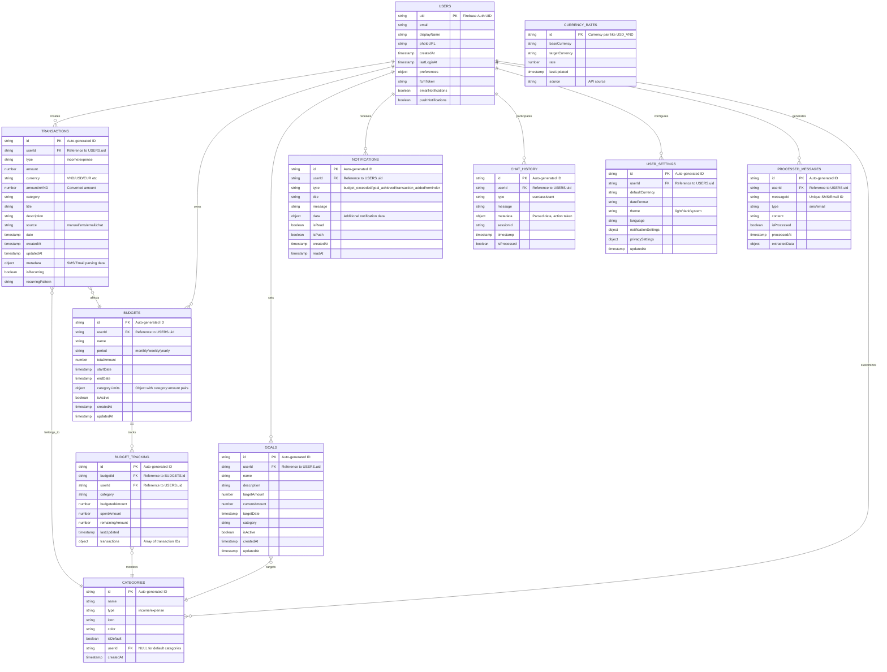

## Authentication Flow Diagram (Completed)


## Chatbot Conversation Flowchart (Completed)


## Transaction Automation Flowchart (Completed)

```mermaid
flowchart TD
    A[User Wants to Add Transaction] --> B{Entry Method?}
    B -->|Manual Form| C[Open Transaction Form]
    B -->|Chat Input| D[User: Add expense 50k groceries]
    B -->|Notification Listener| E[Detect Bank Notification]
    C --> F[Fill Transaction Details]
    F --> G[Select Category]
    G --> H[Choose Date]
    H --> I[Enter Amount]
    I --> J[Add Notes (Optional)]
    D --> K[Parse Chat Message]
    K --> L{Data Extraction Successful?}
    L -->|Yes| M[Auto-fill Form Fields]
    L -->|No| N[Ask for Clarification]
    N --> O[User Provides More Details]
    O --> K
    E --> P[Parse Notification Text]
    P --> Q{Recognizable Format?}
    Q -->|Yes| R[Extract Transaction Info]
    Q -->|No| S[Skip or Ask User for Help]
    M --> T[Review Auto-filled Data]
    J --> T
    R --> T
    T --> U{Is Data Valid?}
    U -->|No| V[Show Validation Errors]
    V --> W[User Fixes Data]
    W --> T
    U -->|Yes| X[Categorize Transaction]
    X --> Y{Category Found?}
    Y -- Yes --> Z[Apply Category]
    Y -- No --> ZA[Ask User to Choose Category]
    ZA --> Z
    Z --> ZB[Save to Firestore]
    ZB --> ZC{Save Successful?}
    ZC -- Yes --> ZD[Update Balance]
    ZC -- No --> ZE[Show Save Error]
    ZE --> ZF[Retry Save]
    ZF --> ZB
    ZD --> ZG[Update Budget Tracking]
    ZG --> ZH{Budget Limit Exceeded?}
    ZH -- Yes --> ZI[Send Budget Alert]
    ZH -- No --> ZJ[Update Statistics]
    ZI --> ZJ
    ZJ --> ZK[Show Success Message]
    ZK --> ZL[Return to Dashboard]
    ZL --> ZM[Sync Across Devices]
```

## Budget Management Flowchart (Completed)


## Notification Service Flowchart (Completed)


## Authentication Use Case Diagram


## Chat System Use Case Diagram


## Transaction Management Use Case Diagram


## Budget Management Use Case Diagram


## Notification System Use Case Diagram


## Complete FinWise App Flow Diagram


## Complete FinWise App Use Case Diagram


## Complete FinWise App Database Schema



## Database Collections Overview

### Core Collections:

1. **USERS** - Firebase Auth integration with user preferences
2. **TRANSACTIONS** - All financial transactions with multi-currency support
3. **BUDGETS** - Budget definitions with category-wise limits
4. **BUDGET_TRACKING** - Real-time budget monitoring and spending tracking

### Support Collections:

5. **CATEGORIES** - Default and custom transaction categories
6. **GOALS** - Savings and financial goals
7. **NOTIFICATIONS** - Push and in-app notification history
8. **CHAT_HISTORY** - AI assistant conversation logs

### System Collections:

9. **CURRENCY_RATES** - Real-time currency conversion rates
10. **USER_SETTINGS** - App preferences and configuration
11. **PROCESSED_MESSAGES** - SMS/Email processing tracking to prevent duplicates

### Key Features:

- **Multi-currency Support**: All transactions store both original and VND amounts
- **Real-time Sync**: Firestore real-time listeners for live updates
- **Duplicate Prevention**: Processed messages tracking for SMS/Email
- **Flexible Categories**: Default system categories + user custom categories
- **Budget Monitoring**: Real-time budget tracking with category-wise breakdowns
- **Notification System**: Comprehensive notification storage and tracking
- **Chat Integration**: Complete conversation history with metadata
- **Goal Tracking**: Financial goals with progress monitoring

## Complete FinWise App Class Diagram (Core Entities)

```mermaid
classDiagram
    %% Core Entity Classes
    class User {
        +uid: string
        +email: string
        +displayName: string
        +photoURL: string
        +createdAt: Date
        +lastLoginAt: Date
        +preferences: UserPreferences
        +fcmToken: string
        +emailNotifications: boolean
        +pushNotifications: boolean
        +validate() boolean
        +updateProfile(data: ProfileData) void
        +getPreferences() UserPreferences
    }

    class Transaction {
        +id: string
        +userId: string
        +type: TransactionType
        +amount: number
        +currency: string
        +amountInVND: number
        +category: string
        +title: string
        +description: string
        +source: TransactionSource
        +date: Date
        +createdAt: Date
        +updatedAt: Date
        +metadata: object
        +isRecurring: boolean
        +validate() boolean
        +convertCurrency(targetCurrency: string) number
        +categorize() Category
    }

    class Budget {
        +id: string
        +userId: string
        +name: string
        +period: BudgetPeriod
        +totalAmount: number
        +startDate: Date
        +endDate: Date
        +categoryLimits: Map~string, number~
        +isActive: boolean
        +createdAt: Date
        +updatedAt: Date
        +calculateSpent() number
        +getRemainingAmount() number
        +isOverBudget() boolean
        +getProgress() number
    }

    class Category {
        +id: string
        +name: string
        +type: TransactionType
        +icon: string
        +color: string
        +isDefault: boolean
        +userId: string
        +createdAt: Date
        +validate() boolean
        +isCustomCategory() boolean
    }

    class Goal {
        +id: string
        +userId: string
        +name: string
        +description: string
        +targetAmount: number
        +currentAmount: number
        +targetDate: Date
        +category: string
        +isActive: boolean
        +createdAt: Date
        +updatedAt: Date
        +getProgress() number
        +isCompleted() boolean
        +getDaysRemaining() number
        +getMonthlyTarget() number
    }

    class Notification {
        +id: string
        +userId: string
        +type: NotificationType
        +title: string
        +message: string
        +data: object
        +isRead: boolean
        +isPush: boolean
        +createdAt: Date
        +readAt: Date
        +markAsRead() void
        +isExpired() boolean
    }

    class ChatMessage {
        +id: string
        +userId: string
        +type: MessageType
        +content: string
        +timestamp: Date
        +metadata: object
        +sessionId: string
        +isProcessed: boolean
        +extractTransactionData() TransactionData
        +getIntent() MessageIntent
    }

    class BudgetTracking {
        +id: string
        +budgetId: string
        +userId: string
        +category: string
        +budgetedAmount: number
        +spentAmount: number
        +remainingAmount: number
        +lastUpdated: Date
        +transactions: string[]
        +updateSpending(amount: number) void
        +getSpendingPercentage() number
        +isOverLimit() boolean
    }

    class CurrencyRate {
        +id: string
        +baseCurrency: string
        +targetCurrency: string
        +rate: number
        +lastUpdated: Date
        +source: string
        +isExpired() boolean
        +convert(amount: number) number
    }

    class UserSettings {
        +id: string
        +userId: string
        +defaultCurrency: string
        +dateFormat: string
        +theme: string
        +language: string
        +notificationSettings: object
        +privacySettings: object
        +updatedAt: Date
        +updateSetting(key: string, value: any) void
        +getNotificationPreference(type: string) boolean
    }

    class ProcessedMessage {
        +id: string
        +userId: string
        +messageId: string
        +type: MessageType
        +content: string
        +isProcessed: boolean
        +processedAt: Date
        +extractedData: object
        +isDuplicate() boolean
        +extractTransactionInfo() TransactionData
    }

    %% Enums and Types
    class TransactionType {
        <<enumeration>>
        INCOME
        EXPENSE
    }

    class TransactionSource {
        <<enumeration>>
        MANUAL
        SMS
        EMAIL
        CHAT
    }

    class BudgetPeriod {
        <<enumeration>>
        WEEKLY
        MONTHLY
        YEARLY
    }

    class NotificationType {
        <<enumeration>>
        BUDGET_EXCEEDED
        GOAL_ACHIEVED
        TRANSACTION_ADDED
        REMINDER
    }

    class MessageType {
        <<enumeration>>
        USER
        ASSISTANT
        SMS
        EMAIL
    }

    %% Relationships
    User ||--o{ Transaction : "creates"
    User ||--o{ Budget : "owns"
    User ||--o{ Goal : "sets"
    User ||--o{ Notification : "receives"
    User ||--o{ ChatMessage : "participates"
    User ||--o{ UserSettings : "configures"
    User ||--o{ ProcessedMessage : "generates"
    User ||--o{ Category : "customizes"

    Budget ||--o{ BudgetTracking : "tracks"
    Budget ||--o{ Transaction : "monitors"
    
    Transaction }o--|| Category : "belongs_to"
    Transaction ||--o{ BudgetTracking : "affects"
    
    Goal }o--|| Category : "targets"
    
    BudgetTracking }o--|| Category : "monitors"
    
    %% Type Dependencies
    Transaction --> TransactionType
    Transaction --> TransactionSource
    Budget --> BudgetPeriod
    Notification --> NotificationType
    ChatMessage --> MessageType
    ProcessedMessage --> MessageType
```

## Core Entity Overview

### **Primary Entities:**
1. **User** - Account and profile management
2. **Transaction** - Financial transactions with multi-currency support
3. **Budget** - Budget configuration and tracking
4. **Category** - Transaction categorization (default + custom)
5. **Goal** - Savings and financial goals

### **Supporting Entities:**
6. **Notification** - Push and in-app notifications
7. **ChatMessage** - AI conversation history
8. **BudgetTracking** - Real-time budget monitoring
9. **CurrencyRate** - Exchange rate management
10. **UserSettings** - App preferences
11. **ProcessedMessage** - SMS/Email duplicate prevention

### **Key Relationships:**
- **User** → **Transaction** (1:Many) - Users create multiple transactions
- **User** → **Budget** (1:Many) - Users can have multiple budgets
- **Budget** → **BudgetTracking** (1:Many) - Track spending per category
- **Transaction** → **Category** (Many:1) - Transactions belong to categories
- **Goal** → **Category** (Many:1) - Goals target specific categories

### **Entity Features:**
- **Validation**: All entities have validation methods
- **Timestamps**: Created/updated timestamps for auditing
- **Business Logic**: Calculation methods (progress, remaining amounts, etc.)
- **Type Safety**: Enums for consistent data types
- **Multi-currency**: Currency conversion support
- **Real-time**: Support for live data updates


